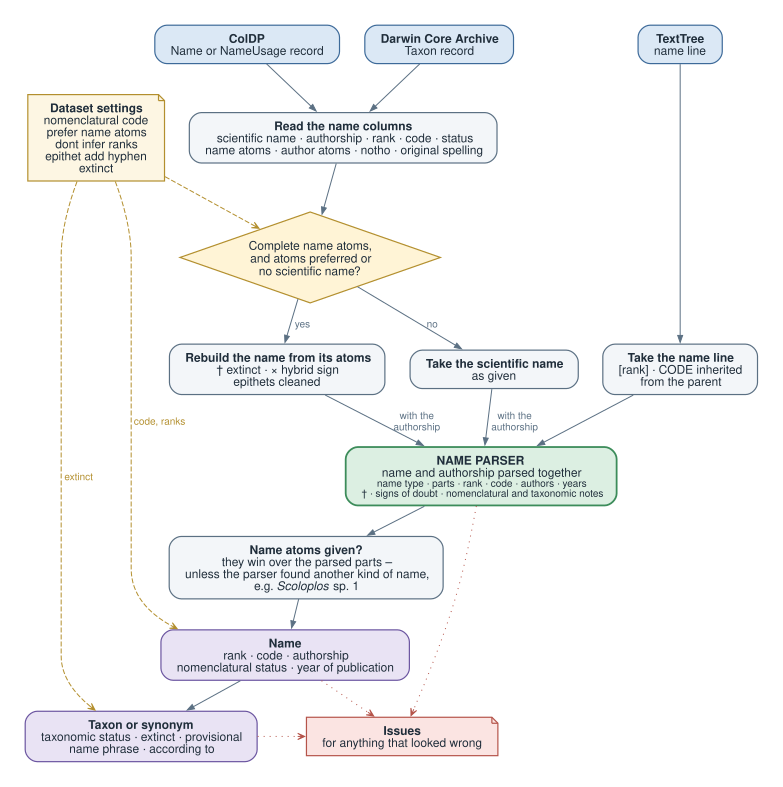

# Names

ChecklistBank keeps names apart from taxonomy. A **name** holds the nomenclature only: how the name is spelled and how
it parses, who authored it, its rank, nomenclatural code and status. Whether a name is accepted, a synonym or a
misapplied name is a matter of a **name usage** - a taxon or a synonym of a dataset that refers to the name. A name
without any usage is a bare name.

This page describes what a name is in ChecklistBank and how names are interpreted when a dataset is imported, from the
[Catalogue of Life Data Package (ColDP)](https://github.com/CatalogueOfLife/coldp), a
[Darwin Core Archive (DwC-A)](https://dwc.tdwg.org/text/) or [TextTree](https://github.com/gbif/text-tree).

## Name types

Real data holds much more than latin binomials. Every name is classified by its syntax into one of these types:

| type | |
|---|---|
| `SCIENTIFIC` | A scientific name, possibly with authorship, including named hybrids. |
| `INFORMAL` | A scientific name with an informal addition or falling short of a regular name: an open nomenclature qualifier (`Abies cf. alba`), an indetermined name (`Abies sp.`), an abbreviated genus (`A. alba`) or a phrase name for an undescribed taxon (`Pultenaea sp. 'Olinda' (Coveny 6616)`). |
| `FORMULA` | A hybrid or graft chimaera *formula*, not a named hybrid. |
| `PLACEHOLDER` | A placeholder like `incertae sedis` or `unknown genus`. |
| `IDENTIFIER` | A machine identifier rather than a name, e.g. a BOLD BIN (`BOLD:AAB5053`), a UNITE species hypothesis (`SH0864666.10FU`) or a culture collection accession. |
| `OTHER` | Anything else that cannot be parsed, e.g. a virus name. |

Scientific and informal names are parsed into their parts. All other types keep the name only as a whole, in the
scientific name.

## The name

| field | |
|---|---|
| `id` | The identifier of the name given by the dataset, unique within the dataset only. |
| `scientificName` | The name without its authorship, see [below](#scientific-name-authorship-and-label). |
| `authorship` | The full authorship: basionym and combination authors, ex and sanctioning authors, years. |
| `label` | The scientific name with its authorship, read only. |
| `rank` | The rank, from a [list of ranks](https://api.checklistbank.org/vocab/rank). |
| `type` | The name type, see above. |
| `code` | The nomenclatural code the name follows. |
| `uninomial` | The name of a genus or a higher taxon. |
| `genus` | The genus of a bi- or trinomial, or of an infrageneric name. |
| `infragenericEpithet` | The epithet of a subgenus, section or other infrageneric name, optionally also given for a binomial. |
| `specificEpithet` | The species epithet. |
| `infraspecificEpithet` | The epithet below the species. |
| `cultivarEpithet` | The cultivar or cultivar group epithet. |
| `unparsed` | Whatever the parser could not make sense of, or the phrase of an informal name. |
| `candidatus` | A *Candidatus* name, a provisional status of incompletely described prokaryotes. |
| `notho` | The part of a named hybrid that is the hybrid: generic, infrageneric, specific or infraspecific. |
| `combinationAuthorship` | The [authorship](#authorship) of the name, excluding the basionym authorship. |
| `basionymAuthorship` | The [authorship](#authorship) of the basionym, the bracketed part. |
| `originalSpelling` | True for an original spelling kept although wrong (`[sic]`), false for a corrected spelling (`corrig.`). |
| `nomStatus` | The [nomenclatural status](#nomenclatural-status). |
| `nomenclaturalNote` | The nomenclatural note as given, e.g. `nom. illeg.` |
| `publishedInId`, `publishedInPage`, `publishedInPageLink` | The reference the name was published in, with the page and a link to it. |
| `publishedInYear` | The year the name was published. |
| `gender`, `genderAgreement` | The grammatical gender of the name, and whether an epithet has to agree with the gender of the genus. |
| `etymology` | The etymology of the name. |
| `link`, `identifier`, `remarks` | A link to the name in its source, further identifiers, and remarks. |
| `namesIndexId` | The entry of the [names index](#names-index-and-matching) the name belongs to. |

### Authorship

An authorship, the combination or the basionym one, holds:

| field | |
|---|---|
| `authors` | The authors, e.g. `["Linnaeus"]`. |
| `exAuthors` | The authors before an *ex*: `Willd. ex Spreng.` has the ex author `Willd.` and the author `Spreng.` |
| `year` | The year of publication. |
| `imprintYear` | A year printed on the work that differs from its actual publication year, written in brackets after the year. |
| `sanctioningAuthor` | The author who sanctioned a fungal name: `Fr.` or `Pers.` |
| `anonymous` | An anonymous work, `Anon.`, or one whose authors are known from elsewhere only and given in brackets. |

### Scientific name, authorship and label

The **scientific name** of a parsed name is written from its parts: the uninomial, or the genus with its epithets, rank
markers where the code uses them - `subsp.`, `var.` and `f.` in botany, none for a zoological subspecies - the hybrid
sign `×`, `"Candidatus …"` in double quotes, a cultivar epithet in single quotes (or followed by `Group` or `gx` for
a cultivar group or grex), `sp.` for an indetermined name, and finally any unparsed rest. An unparsable name keeps its
scientific name as given.

The **authorship** is written from its parsed authors when it came inside the scientific name or from ColDP author
atoms; an authorship given in a column of its own is kept as given, cleaned up (see [authorship](#8-authorship)).

The **label** of a name adds `[sic]` or `corrig.` and the authorship to the scientific name. The label of a taxon or a
synonym also starts with `†` when the taxon is extinct and ends with the name phrase and `sensu` and its *according
to* reference, if given; a misapplied name without either gets `auct. non`.

## Nomenclatural code

`BOTANICAL` (ICN), `ZOOLOGICAL` (ICZN), `BACTERIAL` (ICNP), `VIRUS` (ICVCN), `CULTIVARS` (ICNCP), `PHYTO` (the
phytosociological code ICPN) and `PHYLO` (PhyloCode). The code decides how a name is written and how its rank markers
and status are read.

## Nomenclatural status

The status of a name takes all known nomenclatural acts into account. The values cover botany and zoology with their
own terms:

| status | botany | zoology | abbreviation | |
|---|---|---|---|---|
| `ESTABLISHED` | *nomen validum* | available | | validly published |
| `NOT_ESTABLISHED` | *nomen invalidum* | unavailable | `nom. inval.` | not validly published, or not accepted by its author |
| `ACCEPTABLE` | *nomen legitimum* | potentially valid | | established and not against any rule |
| `UNACCEPTABLE` | *nomen illegitimum* | objectively invalid | `nom. illeg.` | established, but against a rule of the code, e.g. a later homonym |
| `CONSERVED` | *nomen conservandum* | conserved name | `nom. cons.` | protected against other names |
| `REJECTED` | *nomen rejiciendum* | rejected | `nom. rej.` | rejected or suppressed |
| `DOUBTFUL` | *nomen dubium* | doubtful | `nom. dub.` | of uncertain sense |
| `MANUSCRIPT` | manuscript name | manuscript name | `ms.` | not published, a working name |
| `CHRESONYM` | chresonym | chresonym | | a name usage cited without *sensu*, so that it looks like a homonym |

## Name relations

Names of a dataset can be related to each other:

| relation | |
|---|---|
| has basionym | The name is a recombination or a change in rank of the related name. |
| spelling correction of | The name corrects the spelling of the related name, an emendation in zoology. |
| based on | The name validates a name that was not validly published before, the *ex* of botanical authorships. |
| replacement name for | The name replaces the related name, a *nomen novum*. |
| conserved over | The name is conserved against the related name, which is rejected. |
| later homonym of | The name is spelled like the related name, but published later and based on another type. |
| superfluous | The name was superfluous when published, based on the same type as the related name. |
| homotypic with | Both names are based on the same type, without saying why. |
| typified by | The higher name is typified by the related name, e.g. a genus by its type species. |

All of them except *later homonym of*, *conserved over* and *typified by* join two names into one homotypic group:
names based on the same type.

## Names index and matching

The names index gives one identifier to every distinct canonical name across all datasets, a name without its
authorship and rank. The canonical names are compared in a normalised form: diacritics and ligatures folded, lower
case, the gender endings of epithets ignored. So `Abies alba Mill.`, `Abies alba` and `Abies albus` share one entry.
A name in a non latin script, or one without any letter or digit, gets none.

Name matching finds a name in a dataset or in the Catalogue of Life by first looking up its names index entry and then
comparing the authorship and rank of the names that share it, telling homonyms apart. A match is one of:

| match | |
|---|---|
| `EXACT` | The canonical name, rank and authorship match, allowing for whitespace and punctuation. |
| `VARIANT` | An orthographic variant of the name, authorship or rank that is still the same name. |
| `CANONICAL` | Only the canonical name matches, the authorship or rank differ. |
| `AMBIGUOUS` | Several names match and cannot be told apart, usually monomials without authorship. |
| `HIGHERRANK` | No sufficiently certain match, a higher taxon matched instead. |
| `NONE` | No match. |
| `UNSUPPORTED` | A name that can never be matched, e.g. a placeholder. |

## How names are interpreted

When a dataset is imported, every name record is interpreted into a name with its parts, rank, code and status, plus a
list of issues for anything that looked wrong. What the parser finds also shapes the taxon or synonym the name belongs
to: an extinct dagger, a doubtful name, a note like `sensu lato`.

All formats end up in the [GBIF name parser](https://github.com/gbif/name-parser-rust), which splits a name string into
its parts. What differs is what a format can tell ChecklistBank beyond that string - name atoms, author atoms, rank,
code and status columns - and the dataset settings that steer the interpretation.

The diagram is also available as [PDF](name-interpretation.pdf) and [PNG](name-interpretation.png).

### 1. Reading the name columns

#### ColDP

A ColDP archive gives names either in a `Name` file or together with the taxonomy in a `NameUsage` file. Both are read
the same way, but some columns have a different name in `NameUsage` because the plain one belongs to the taxon:

| | Name | NameUsage |
|---|---|---|
| scientific name, authorship | `scientificName`, `authorship` | the same |
| rank, code | `rank`, `code` | the same |
| name atoms | `uninomial`, `genus` (or `genericName`), `infragenericEpithet`, `specificEpithet`, `infraspecificEpithet`, `cultivarEpithet` | the same, but `genericName` instead of `genus` |
| author atoms | `combinationAuthorship`, `combinationExAuthorship`, `combinationAuthorshipYear`, `basionymAuthorship`, `basionymExAuthorship`, `basionymAuthorshipYear` | the same |
| hybrid part, original spelling | `notho`, `originalSpelling` | the same |
| nomenclatural status | `status` | `nameStatus` |
| year of publication | `publishedInYear` | `namePublishedInYear` |
| remarks, alternative ids | `remarks`, `alternativeID` | `nameRemarks`, `nameAlternativeID` |

Several authors in an author atom column are separated by a pipe: `Linnaeus|Smith`.

#### Darwin Core Archive

A DwC-A `Taxon` record has no uninomial and no author atoms:

| | Darwin Core term |
|---|---|
| scientific name, authorship | `scientificName`, `scientificNameAuthorship` |
| rank | `taxonRank`, else `verbatimTaxonRank` |
| code | `nomenclaturalCode` |
| name atoms | `genericName` (or `genus`), `infragenericEpithet`, `specificEpithet`, `infraspecificEpithet`, `cultivarEpithet` |
| nomenclatural status | `nomenclaturalStatus` |
| year of publication | `namePublishedInYear` |

For a genus or a higher rank the `genus` term is read as the uninomial, flagged `UNINOMIAL_FIELD_MISPLACED`.

#### TextTree

A TextTree line holds the whole name, including its authorship, with the rank in square brackets after it:
`Abies alba Mill. [species]`. The nomenclatural code comes from a `CODE` info item and is inherited by all names below
it; a `NOM` info item gives the nomenclatural status. TextTree has no atoms, so the interpretation always parses the
name line.

### 2. Dataset settings

A few dataset settings, set by the editors of a dataset, change how its names are interpreted:

| setting | effect |
|---|---|
| nomenclatural code | the code of every name that does not give one itself |
| prefer name atoms | use the name atoms rather than the scientific name when both are given. The default is yes for ColDP and no for DwC-A |
| dont infer ranks | never derive a rank from the name itself when the record gives none, except from a rank marker written in the name |
| epithet add hyphen | join an epithet of several words with hyphens (`sancti vincentii` → `sancti-vincentii`) |
| extinct | a rank: all taxa of this rank or below are extinct |

### 3. Name atoms or scientific name

Name atoms are used when they are preferred, or when no scientific name is given at all - and only if they are
complete for the rank of the record:

| rank | atoms needed |
|---|---|
| infrageneric, e.g. subgenus or section | `uninomial` or `infragenericEpithet` |
| genus or higher | `uninomial` or `genus` |
| species | `genus` and `specificEpithet` |
| below species | `genus`, `specificEpithet` and `infraspecificEpithet` or `cultivarEpithet` |
| none | any atom |

Otherwise the scientific name is used. Atoms are cleaned before the name is built from them:

- an extinct dagger `†` is removed and marks the taxon as extinct;
- a hybrid sign `×` (or a letter `x` followed by a space) is removed and marks that part of the name as the hybrid one;
- an epithet with capital letters is lower cased, flagged `UPPERCASE_EPITHET`;
- with *epithet add hyphen* an epithet of several words is hyphenated, flagged `MULTI_WORD_EPITHET`;
- an infrageneric name given as `uninomial` is moved to `infragenericEpithet`, flagged `INFRAGENERIC_FIELD_MISPLACED`.

### 4. Parsing

The name parser gets the scientific name - as given, or rebuilt from the atoms - together with the separate authorship,
the rank and the code known so far. It parses both in one go, so that the authorship can tell it the code and the name
can tell it how to read the authorship. The result is one of:

- a **parsed name** with its parts, for scientific names and for informal names with a species epithet, e.g.
  `Abies cf. alba`;
- an **informal name** anchored on a genus or higher taxon, like `Abies sp.`, `Rhizobium sp. RMCC TR1811` or
  `Bartonella group`, which is kept as a name of type `INFORMAL` with its phrase as the unparsed rest;
- an **unparsable name** - a virus, a hybrid formula, a placeholder, an identifier or anything else - which keeps its
  scientific name as given, with its name type and, for viruses, the virus code.

Besides the parts of the name the parser recognises an extinct dagger `†`, signs of doubt such as a question mark or a
genus in square brackets (`[Cambarus] bartonii`), and notes that are no part of the name: nomenclatural notes, taxonomic
notes and citations (see [authorship](#8-authorship) and [taxa and synonyms](#10-taxa-and-synonyms)).

An authorship can be given inside the scientific name, in a column of its own, or both. When both are given and differ,
the separate authorship wins. A separate authorship that only holds less than the one in the name - no year, no
basionym brackets - does not throw the parsed information of the name away: `Dumbletonius Dugdale, 1986` with the
authorship `Dugdale` keeps the year 1986.

Parts the parser does not understand stay as the unparsed rest of the name, flagged `PARTIALLY_PARSABLE_NAME`; a name
that cannot be parsed at all although it looks like a scientific name is flagged `UNPARSABLE_NAME`. Warnings of the
parser become issues, e.g. `HOMOGLYPH_CHARACTERS`, `QUESTION_MARKS_REMOVED`, `INDETERMINED` or `DOUBTFUL_NAME`.

### 5. Atoms against the parsed name

When the name was rebuilt from its atoms, the atoms win over the parsed parts - the data publisher knows best - and
everything else comes from the parse: authorship, code, notes. If the parsed parts differ from the atoms, for example
because the parser cleaned an epithet, the name is flagged `PARSED_NAME_DIFFERS`.

The parser wins when it classifies the rebuilt name as another kind of name than the atoms suggest: genus `Scoloplos`
with the specific epithet `sp. 1` is the informal name `Scoloplos sp. 1`, not a species with the epithet "sp. 1".

### 6. Rank

The rank column is parsed with the code in mind, as rank markers differ between codes. Single letters are too ambiguous
to be a rank and are flagged `RANK_INVALID`, except `f` and `v`. Without a rank column a rank marker at the start of the
infraspecific epithet is used: `var. alba`.

When a record gives no rank, the rank is derived from the name:

- a rank marker written in the name is always used: `Festuca rubra subsp. pruinosa` is a subspecies;
- otherwise the structure of a scientific name decides - a binomial is a species, a trinomial an infraspecific name -
  unless the dataset setting *dont infer ranks* is on;
- names of genera and higher ranks never get a rank from their suffix: an ending like `-idae` is not reliable enough;
- a name starting in lower case gets no derived rank, e.g. `cellular organisms`.

### 7. Nomenclatural code

The code comes from the code column of the record or the TextTree `CODE` info item, else from the dataset setting, else
the parser infers it from the name and its authorship where they tell it - from a botanical rank marker like `subsp.`,
or from the style of an authorship like `(L.) Mill.` or `(Blumenbach, 1799)`. An unknown code value is flagged
`NOMENCLATURAL_CODE_INVALID`.

### 8. Authorship

- **Author atoms** (ColDP only) always win over an authorship string. The authorship is then written from the atoms:
  `basionymAuthorship` Linnaeus and `combinationAuthorship` Miller give `(Linnaeus) Miller`. An author given as `Anon.`,
  or all authors in square brackets, make an anonymous authorship.
- A **separate authorship** is parsed into its combination and basionym authors, ex authors, years and sanctioning
  author, but kept as given in the data, cleaned up: whitespace and punctuation are normalised, `and`, `et` and `und`
  become `&`, `et al.` is written alike, and a year is preceded by a comma.
- An **authorship inside the scientific name** is written from its parsed parts.

Notes in an authorship are moved out of it:

| note | example | goes to |
|---|---|---|
| nomenclatural note | `nom. illeg.`, `nom. nud.`, `ined.` | the nomenclatural status of the name, flagged `AUTHORSHIP_CONTAINS_NOMENCLATURAL_NOTE` |
| taxonomic note | `sensu lato`, `sensu Smith 1999`, `non Hampson 1906`, `auct.` | the taxon or synonym, see [taxa and synonyms](#10-taxa-and-synonyms) |
| original spelling | `[sic]`, `corrig.` | the original spelling flag of the name |
| publication | `Smith in Jones, 1900` | the published in reference of the name |

### 9. Nomenclatural status and year

The nomenclatural status of a name comes from, in this order:

1. the status column of the record, flagged `NOMENCLATURAL_STATUS_INVALID` if it cannot be understood;
2. a nomenclatural note in the authorship. If it contradicts the status column the name is flagged
   `CONFLICTING_NOMENCLATURAL_STATUS`;
3. a manuscript name the parser recognises, e.g. `Meneghini in litt.`;
4. a nomenclatural statement in the taxonomic status column, e.g. `nomen nudum`, flagged
   `DERIVED_NOMENCLATURAL_STATUS` - for DwC-A and ColDP `NameUsage` records.

A status value that is not exactly one of the status values above is also kept in the remarks of the name.

The year of publication comes from the year column, else from the year of the combination authorship. If both are
given and differ, the name is flagged `PUBLISHED_YEAR_CONFLICT`; implausible years are flagged `UNLIKELY_YEAR`.

### 10. Taxa and synonyms

The taxonomic status of a record decides whether its name becomes an accepted taxon, a synonym or a bare name without
any taxonomy. What the parser found in the name then sets some properties of that taxon or synonym, unless the record
gives them in columns of their own:

| | ColDP | DwC-A | TextTree |
|---|---|---|---|
| taxonomic status | `status` | `taxonomicStatus` | `=` or `≡` before a synonym |
| extinct taxon | the `extinct` column; without one a `†` in the name or its atoms, or the dataset setting *extinct* | a `†` in the name or its atoms, or the dataset setting *extinct*; `isExtinct` of a species profile extension | a `†` before the name |
| provisionally accepted taxon | the `provisional` column, or a doubtful name | a doubtful name | a `?` before the name, or a doubtful name |
| name phrase | the `namePhrase` column; without one the taxonomic note of the authorship | the taxonomic note of the authorship | |
| according to | the `accordingToID` column | the `nameAccordingTo` column, or a `sensu`, `sec.`, `fide` or `according to` note in the authorship | |

- Only taxa can be extinct. A DwC-A synonym whose name carries a `†` is flagged `NAME_CONTAINS_EXTINCT_SYMBOL`.
- A doubtful name - a question mark, a genus in square brackets - makes an accepted taxon provisionally accepted.
- In a DwC-A record a taxonomic note that cites a work, like `sensu Smith 1999` or `sec. Jones 2004`, becomes the
  *according to* reference of the usage, and anything around it the name phrase. Notes that cite no work, like
  `sensu lato`, `sensu stricto`, `non Smith` or `auct.`, become the name phrase. If the record also has a
  `nameAccordingTo`, the usage is flagged `ACCORDING_TO_CONFLICT`. Every taxonomic note is flagged
  `AUTHORSHIP_CONTAINS_TAXONOMIC_NOTE`, and a bare name keeps it in its remarks instead.
- A name phrase without any letter, with unmatched brackets or that is just true or false is flagged
  `NAME_PHRASE_UNLIKELY`.
- A DwC-A record with the taxonomic status of a bare name, e.g. `unavailable name`, that still names an accepted taxon
  is a synonym.

### Examples

| record | interpreted name |
|---|---|
| DwC-A: `scientificName` Abies alba, `scientificNameAuthorship` Mill., `taxonRank` species | species *Abies alba* Mill., combination author Mill. - no code unless the dataset sets one, `Mill.` alone does not tell it |
| ColDP: `genericName` Picea, `specificEpithet` abies, `authorship` (L.) H.Karst. | species *Picea abies* (L.) H.Karst. from the atoms, basionym author L., combination author H.Karst. |
| ColDP: `genus` Scoloplos, `specificEpithet` sp. 1, `rank` species | informal name *Scoloplos* sp. 1, flagged `INDETERMINED` |
| ColDP: `scientificName` Abies alba, `combinationAuthorship` Mill., `combinationAuthorshipYear` 1768, `authorship` Miller | *Abies alba* Mill., 1768 - the author atoms win |
| ColDP: `uninomial` × Agropogon, `rank` genus, `authorship` P.Fourn. | genus *× Agropogon* P.Fourn., the generic part a hybrid, botanical code (inferred) |
| ColDP: `genericName` [Cambarus], `specificEpithet` bartonii, `authorship` (Fabricius, 1798) | *Cambarus bartonii* (Fabricius, 1798), zoological code (inferred), a provisionally accepted taxon, flagged `DOUBTFUL_NAME` |
| DwC-A: `scientificName` Abies alba, `scientificNameAuthorship` Mill. sensu Smith 1999 | *Abies alba* Mill., according to the reference *Smith 1999* |
| DwC-A: `scientificName` † Mammuthus primigenius (Blumenbach, 1799), `taxonomicStatus` accepted | extinct taxon *Mammuthus primigenius* (Blumenbach, 1799), zoological code (inferred) |
| TextTree: `Boyeria vinosa [sic] (Say, 1840) [species]` | species *Boyeria vinosa* (Say, 1840), original spelling, zoological code (inferred) |
| DwC-A: `scientificName` BOLD:AAA1234 | unparsed name of type `IDENTIFIER` |

### Matching and the name parser

The [name matching API](https://api.checklistbank.org) and the name parser tool interpret a name given as a string,
optionally with an authorship, rank and code, the same way - without dataset settings and without deriving a rank from
the structure of the name. A rank marker written in the name is used.
